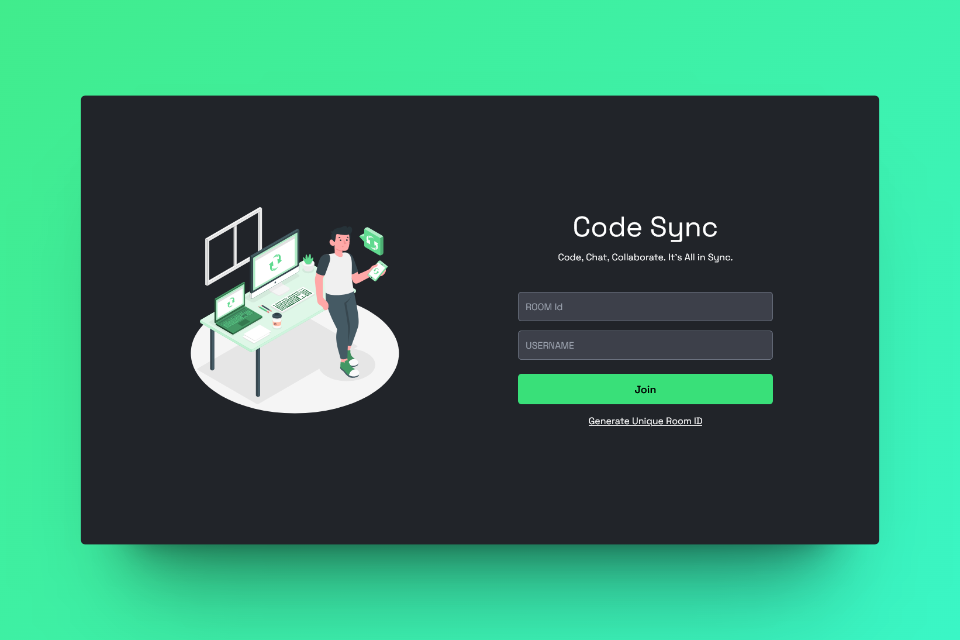

# Code Sync

Code Sync is a real-time collaborative development platform that allows developers to write code, draw diagrams, and communicate seamlessly in a shared environment.



## 🚀 Features

- **Collaborative Code Editor**: Real-time multi-user code editing with syntax highlighting for multiple languages via CodeMirror.
- **Collaborative Whiteboard**: Integrated drawing tool using tldraw for architectural diagrams and brainstorming.
- **Real-time Chat**: Built-in chat system for team communication within the workspace.
- **File Management**: Create, rename, and delete files/folders with real-time synchronization across all participants.
- **User Presence**: See who is online and track their cursor positions in real-time.
- **Responsive Design**: Modern and sleek UI built with Tailwind CSS.

## 🛠️ Tech Stack

### Frontend
- **React**: UI library for building the interface.
- **Vite**: Modern build tool for fast development.
- **Tailwind CSS**: Utility-first CSS framework for styling.
- **CodeMirror**: Extensible code editor component.
- **tldraw**: Infinite canvas for drawing and diagramming.
- **Socket.io-client**: Real-time bidirectional communication.

### Backend
- **Node.js**: JavaScript runtime environment.
- **Express**: Fast, unopinionated, minimalist web framework.
- **Socket.io**: Real-time engine for event-based communication.
- **TypeScript**: Typed superset of JavaScript for better development experience.

## 📦 Getting Started

### Prerequisites
- [Node.js](https://nodejs.org/) (v16.x or higher)
- [npm](https://www.npmjs.com/)

### Installation

1. **Clone the repository**:
   ```bash
   git clone https://github.com/nirvair09/Code_Sync
   cd Code_Sync
   ```

2. **Setup Server**:
   ```bash
   cd server
   npm install
   ```

3. **Setup Client**:
   ```bash
   cd ../client
   npm install
   ```

### Running the Application

1. **Start the Backend Server**:
   ```bash
   cd server
   npm run dev
   ```
   The server will start on `http://localhost:3000` (or the port specified in your `.env`).

2. **Start the Frontend Client**:
   ```bash
   cd client
   npm run dev
   ```
   The client will be available at `http://localhost:5173`.

## 🐳 Docker Setup

You can also run the entire application using Docker:

```bash
docker-compose up --build
```

## 🤝 Contributing

Contributions are welcome! Please see [CONTRIBUTING.md](./CONTRIBUTING.md) for guidelines.

## 📄 License

This project is licensed under the MIT License - see the [LICENSE](./LICENSE) file for details.
